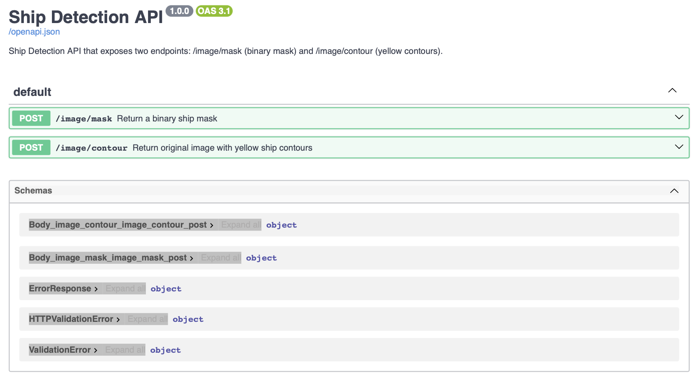
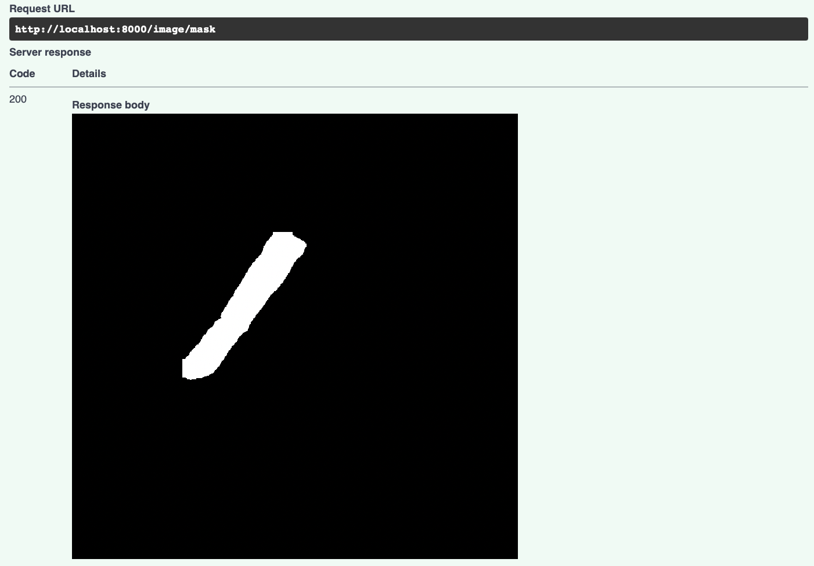
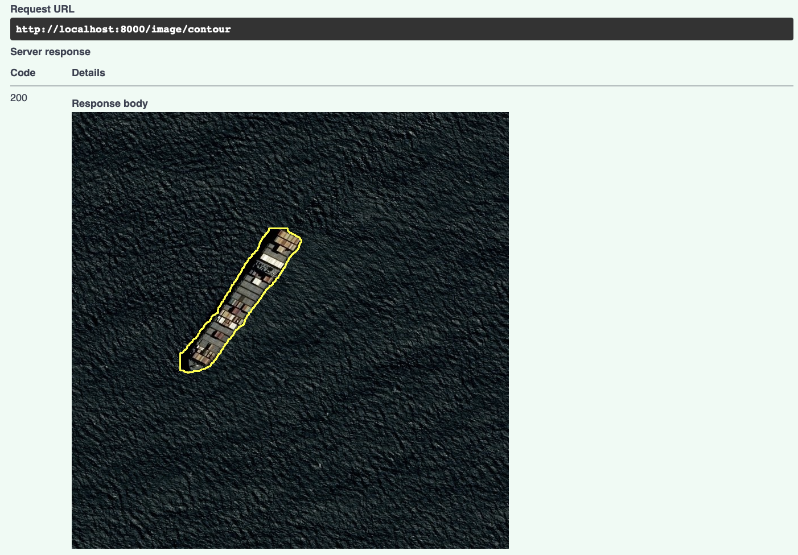

# Data Science Cell Assessment - Airbus Ship Detection

## Files included
- dsc_defensie_assessment.ipynb (image & mask visualizations, inference and evaluation)(**Part 1 of assignment**)
- app/main.py (FastAPI app with 2 end points) (**Part 2 of assignment**)
- src/model.py (ShipDetector object for model loading & prediction)
- src/evaluation.py (evaluation helpers)
- src/utils.py (rle encoding and decoding helpers)
- requirements.txt (dependencies)

## Run Notebook (dev)
1. Create a virtual environment and install dependencies
    ```sh
    python3 -m venv venv-shipdetector
    ```

2. Activate environment (or select environment in VSCode to run Jupyter Notebook)
    ```sh
    # macOS / Linux
    source venv-shipdetector/bin/activate

    # Windows
    venv-shipdetector\Scripts\activate
    ```

3. Install dependencies into environment
    ```sh
    pip install --upgrade pip
    pip install -r requirements.txt
    ```

4. Run the Notebook `dsc_defensie_assessment.ipynb` and install kernel


## Start API
1. Install Docker 🐳

    [Get Docker](https://docs.docker.com/get-docker/)

1. Start API from within project ROOT:
    ```sh
    docker build -t shipdetector-api:latest .
    docker run --rm -p 8000:8000 -e MODEL_PATH="models/yolo11n-seg.pt" shipdetector-api:latest
    ```
2. **Try out** both endpoints: `/image/mask` `/image/contour`
    1. Open http://localhost:8000/docs
    2. Open either of the 2 endpoints
    3. Hit `Try it out`
    4. Upload an image
    5. Hit `Execute` to see the resulting mask/contour

    **NOTE**: You might need to try some images to see a mask/contour, due to the unsuited model.


## UI Example 
*API response using training set image*: **0006c52e8.jpg**








## Assumptions / notes
- Used pre-trained YOLO segmentation nano for simplicity. 
- YOLO was trained on COCO, which does not include aerial imagery.
- All resulting masks (all classes) will be considered as boat for simplicity.
- Do not expect good model results for the reasons above. 